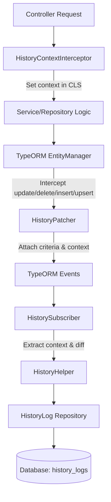

# nestjs-typeorm-history-log

[](https://www.npmjs.com/package/nestjs-typeorm-history-log)
[](https://opensource.org/licenses/MIT)

**Automatic audit trail for NestJS and TypeORM.** Records who changed what, when, and what it was before—including `QueryBuilder` and bulk updates that default TypeORM subscribers miss. Zero config to start; extend with custom entities and options when you need to.

---

## Table of contents

- [Prerequisites](#-prerequisites)
- [Installation](#-installation)
- [Quick Start (3 steps)](#-quick-start-3-steps)
- [Why This Library Exists](#why-this-library-exists)
- [What Actually Happens](#what-actually-happens)
- [Usage Guide](#usage-guide)
- [Advanced Configuration (The 3 Tiers)](#-advanced-configuration-the-3-tiers)
- [Advanced Features](#-advanced-features)
- [Core Components](#core-components)
- [How It Fits Together](#how-it-fits-together)
- [What Gets Stored](#what-gets-stored)
- [When a history row is not written](#when-a-history-row-is-not-written)
- [API Reference](#-api-reference)
- [Testing & Edge Cases](#testing--edge-cases)
- [Troubleshooting](#troubleshooting)
- [Contributing & License](#contributing--license)

---

## Prerequisites

- **Node.js** 18+ (LTS recommended)
- **NestJS** 8+
- **TypeORM** 0.3+
- **nestjs-cls** 3+ (request-scoped context)

Peer dependencies are installed automatically by npm (v7+), pnpm, and bun. With **Yarn v1**, install peer dependencies yourself if you see warnings.

---

## Installation

Use your preferred package manager:

```bash
# npm
npm install nestjs-typeorm-history-log

# pnpm
pnpm add nestjs-typeorm-history-log

# yarn
yarn add nestjs-typeorm-history-log

# Bun
bun add nestjs-typeorm-history-log
```

---

## Quick Start (3 steps)

Get running in three steps:

1. **Register the module** in `AppModule`:

```typescript
import { HistoryModule } from 'nestjs-typeorm-history-log';

@Module({
  imports: [HistoryModule.forRoot()],
})
export class AppModule {}
```

2. **Mark entities to track** with a stable `entityKey`:

```typescript
import { EntityHistoryTracker } from 'nestjs-typeorm-history-log';

@Entity('projects')
@EntityHistoryTracker({ entityKey: 'project-entity' })
export class Project {
  @PrimaryGeneratedColumn() id: number;
  // ...
}
```

3. **Attach request context** on routes that change data (so we know *who* did it):

```typescript
import { HistoryContext } from 'nestjs-typeorm-history-log';

@Patch(':id')
@HistoryContext({ entityKey: 'project' })  // uses :id from params
update(@Param('id') id: string) { /* ... */ }
```

The library requires a **user id for every history row**; if none is found, it throws. On HTTP routes use `@HistoryContext` (and ensure `request.user` or your auth sets the user). For **background jobs, cron, or non-HTTP code paths** that perform tracked changes, either set context (e.g. pass `context: { user_id, ... }` when calling `saveLog` manually) or run the code inside `HistoryHelper.ignore(callback)` so no log is written and no error is thrown. To customize where the user is read from on the request, set `userRequestKey`, `userIdField`, and optionally `userEntity` in `forRoot()` — see [User identity](#user-identity).

---

## Why This Library Exists

### 1. TypeORM subscribers miss a lot

By default, TypeORM subscribers see `repository.save()` and `repository.remove()`, but not `manager.update()`, `manager.delete()`, `manager.insert()`, or `manager.upsert()`—the same methods used with QueryBuilder or bulk updates. When they do run, you often get only the new state, not the old one, so you can't tell what actually changed.

This library patches those methods. Before each call it stores the current request context and the operation's criteria (e.g. `{ id: 5 }`) on the database connection. When the subscriber runs, it loads the old row(s) from the DB and builds a proper before/after snapshot. You get correct history even for QueryBuilder and bulk writes.

### 2. Events often give you half the picture

With `.save()` and `.remove()`, event payloads can be partial (only the columns you passed) or out of sync inside a transaction. The library doesn't rely on the event alone: it re-queries by criteria to get the full row, then merges. The log always has a consistent before/after view.

### 3. Request context can get mixed up

Many audit setups store the current user in AsyncLocalStorage (e.g. nestjs-cls). When many requests run at once, one request can overwrite that store before the subscriber runs, so a change gets attributed to the wrong user. The library copies the context onto the connection when the operation starts and reads it from there when writing the log, so the correct user stays tied to the correct write under load.

---

**Use this library when** you need a real audit trail (who, what, when, and what it was before), you use QueryBuilder or bulk ops, or you care about compliance and support. **Skip it when** you only use `repository.save()` and are okay with partial or missing history, or you're building something throwaway.

---

## What Actually Happens

- **Module:** Registers a global NestJS module with `HistoryHelper`, an interceptor, and a TypeORM subscriber. Optionally patches `EntityManager.update/delete/insert/upsert`.
- **Interceptor:** On routes with `@HistoryContext`, runs first and stores context in CLS (parent entity key/id, user id from `request.user`, optional extra from `metadataProvider`).
- **Patcher:** Before each patched call, if the entity is tracked, stores the operation criteria and a copy of the current CLS context on the QueryRunner. Clears it after the call.
- **Subscriber:** Listens to insert/update/remove. For tracked entities it gets context from the QueryRunner (or CLS), loads old rows by criteria, and calls `HistoryHelper.saveLog` with old state, new state, and action. Soft-deletes (e.g. `is_deleted` flipped to true) are logged as DELETE.
- **HistoryHelper.saveLog:** Resolves context (manual > sealed on connection > CLS), requires `user_id` or throws. Builds content: full payload for CREATE/DELETE, diff for UPDATE (via `microdiff`). Filters out keys in `ignoredKeys` and columns marked `@HistoryColumnExclude`. Skips saving if an UPDATE has no changes. Writes a row to your history table in the same transaction.
- **findAll:** Query helper that turns `fromDate`, `entityKey`, `userId`, `page`, `limit`, etc. into a TypeORM query and returns `{ data, total }`. Default order is `created_at DESC`.
- **addMetadata:** Merges an object into the current request's context metadata. Next log written in that request will include it.
- **ignore:** Runs your callback in a context where history is disabled. No log rows are written for changes inside that callback.

---

## Usage Guide

The [Quick Start](#-quick-start-3-steps) gets you going. Here’s a bit more detail.

### 1. Register Module

`HistoryModule.forRoot()` registers the built-in `HistoryLog` entity and sets up `nestjs-cls`. No extra config required for default behavior.

### 2. Enable Tracking on Entities

Use a **stable, unique** `entityKey` per entity (e.g. `'project-entity'`). It is stored in every history row and used for filtering.

### 3. Capture Request Context

`@HistoryContext({ entityKey: 'project' })` reads the parent ID from route params by default (`:id`). Use `idKey` and `location` to read from `body` or `query` instead.

### User identity

The library requires a user id for every log. By default it reads `request.user.id` (Passport-style). If it can’t find one, it throws.

To use a different request key or id field (e.g. `req.principal.uuid`), set `userRequestKey` and `userIdField` in `forRoot`:

```typescript
HistoryModule.forRoot({
  userRequestKey: 'principal', // Look for request.principal
  userIdField: 'uuid',        // Look for request.principal.uuid
  userEntity: User,           // Link user_id as a relation to your User entity
})
```

`userRequestKey` = where on the request we look (e.g. `'user'` or `'principal'`). `userIdField` = which property holds the id (e.g. `'id'` or `'uuid'`). `userEntity` is for TypeORM relations only (e.g. linking to a User table); we don’t use it to read the user.

### 4. Querying logs

`HistoryHelper.findAll(options)` takes filters like `userId`, `entityKey`, `fromDate`, `page`, `limit` and returns `{ data, total }`.

```typescript
@Controller('history')
export class HistoryController {
  constructor(private readonly history: HistoryHelper<MyHistory>) {}

  @Get()
  async getLogs(@Query('userId') userId: string) {
    return this.history.findAll({
      userId,
      entityKey: 'project',
      fromDate: new Date('2020-01-01'), // example: filter from a given date
      page: 1, 
      limit: 10,
    });
  }
}
```

---

## 🛠 Advanced Configuration (The 3 Tiers)

The library supports three progressive levels of customization:

### Tier 1: Zero-config

Call `HistoryModule.forRoot()` with no options. It uses the built-in `HistoryLog` entity (table `history_logs`). If you use `autoLoadEntities: true` in TypeORM you’re done; otherwise add `HistoryLog` to your `entities` array.

#### If you don’t use autoLoadEntities
If using `autoLoadEntities: true`, the library registers the entity automatically. Otherwise:
```typescript
import { HistoryLog } from 'nestjs-typeorm-history-log';
TypeOrmModule.forRoot({ entities: [HistoryLog] })
```

### Tier 2: Add your own columns

Extend `BaseHistoryLog`, add columns (e.g. `ip`, `user_agent`), and pass your class as `historyLogEntity: MyHistory`. Use `metadataProvider(req)` in `forRoot()` to fill those columns from the request; the keys you return must match your entity’s properties.

```typescript
import { BaseHistoryLog } from 'nestjs-typeorm-history-log';

@Entity()
class MyHistory extends BaseHistoryLog {
  @Column() ip: string;
  @Column({ name: 'user_agent', nullable: true }) user_agent: string;
}

HistoryModule.forRoot({
  historyLogEntity: MyHistory,
  metadataProvider: (req) => ({
    ip: req.ip,
    user_agent: req.headers['user-agent'],
  }),
})
```

**OR** add metadata per handler with `HistoryHelper.addMetadata` (e.g. when you want different data per route or from your own logic):

```typescript
// Your entity can have optional columns filled by addMetadata
@Entity()
class MyHistory extends BaseHistoryLog {
  @Column({ nullable: true }) ip: string;
  @Column({ name: 'reason', nullable: true }) reason: string;
}

// In a controller or service: set metadata before the change (same request)
constructor(private historyHelper: HistoryHelper<MyHistory>) {}

@Patch(':id')
@HistoryContext({ entityKey: 'project' })
update(@Param('id') id: string, @Body() dto: UpdateProjectDto, @Req() req: Request) {
  this.historyHelper.addMetadata({ reason: 'Security Patch', ip: req.ip });
  return this.projectService.update(id, dto);
}

// Or in a service method (inject HistoryHelper and call addMetadata before the DB write)
// this.historyHelper.addMetadata({ reason: 'Bulk import' });
```

### Tier 3: Custom table and mapping

Use any entity and an `entityMapper` to turn our internal data into your table shape.
```typescript
@Entity()
class CustomLogs {
  @PrimaryGeneratedColumn() id: number;
  @Column() event_name: string; 
  @Column() payload: string;    
}

HistoryModule.forRoot({
  historyLogEntity: CustomLogs,
  entityMapper: (data) => ({
    event_name: data.action,
    payload: JSON.stringify(data.content)
  })
})
```

#### 🔍 What's inside the `data` parameter?
| Property | Description |
| :--- | :--- |
| `data.action` | `'CREATE'`, `'UPDATE'`, or `'DELETE'` |
| `data.entityKey` | The key of the entity being modified |
| `data.entityId` | The primary key of the record |
| `data.contextEntityKey` | Parent context key |
| `data.contextEntityId` | Parent record ID |
| `data.user_id` | ID of the user who made the change |
| `data.content` | The diff/snapshot object |

**Smart guard:** If your entity doesn’t extend `BaseHistoryLog` and `patchGlobal` is true, TypeScript requires `entityMapper` (we need to know how to map to your table). If you extend `BaseHistoryLog` or set `patchGlobal: false`, `entityMapper` is optional.

### `metadataProvider`

A function `(req) => ({ ... })` that runs on every request. Whatever you return is merged into each history row for that request (e.g. IP, trace id).

- **Tier 1:** Default `HistoryLog` has no extra columns, so there’s nowhere to store it. Skip `metadataProvider` or move to Tier 2.
- **Tier 2:** Add columns to your entity (e.g. `ip`). Return an object whose keys match those column names.
- **Tier 3:** Return any keys; in `entityMapper` you read them from `data` (e.g. `data.trace_id`) and map to your table.

---

## 🛠 Advanced Features

### 1. Add metadata for this request

`metadataProvider` in `forRoot()` runs for every request and fills extra columns from the request. For per-handler or per-request notes (e.g. “why” this change), use `historyHelper.addMetadata({ ... })`. It merges into the current request’s context so every history row written in that request includes it. Call it before the code that does the change. Multiple calls merge (later keys overwrite earlier ones).

```typescript
// In forRoot(): metadataProvider fills columns from the request (e.g. IP, user-agent)
HistoryModule.forRoot({
  historyLogEntity: MyHistory,
  metadataProvider: (req) => ({ ip: req.ip }),
})

// In a controller: addMetadata adds extra data for this request only (e.g. reason)
constructor(private historyHelper: HistoryHelper<HistoryLog>) {}

@Patch()
@HistoryContext({ entityKey: 'project' })
update() {
  this.historyHelper.addMetadata({ reason: 'Security Patch' });
  return this.service.save();
}
```

### 2. Writing history from workers, cron, or custom SQL

Use `saveLog` when there’s no HTTP request (workers, cron) or when you change data outside the normal entity flow (e.g. raw SQL) and want to record a log yourself. Pass `logData` (entityKey, action, oldState, payload, entityTarget), the same `manager` you use for the write (so it’s one transaction), and `context` with at least `user_id` (e.g. `0` for “system”). The library still requires a user id or it throws.

```typescript
// Example: you need manager, entityTarget, oldState, payload, and context
await this.historyHelper.saveLog({
  logData: {
    entityKey: 'sync-task',
    action: HistoryActionType.UPDATE,
    entityTarget: SomeEntity,
    oldState: {},
    payload: { id: 1, name: 'Synced' },
  },
  manager: this.dataSource.manager,
  context: { user_id: 0, contextEntityKey: 'system', contextEntityId: null },
});
```

### 3. Skip history for one block

`historyHelper.ignore(async () => { ... })` runs your callback in a context where history is turned off. Nothing that happens inside (e.g. a bulk fix or migration step) gets logged. The callback can be async. Other requests are unaffected.

```typescript
await this.historyHelper.ignore(async () => {
  await this.repository.update(id, { noise: 'data' });
});
```

### 4. Hiding or including columns

- **`@HistoryColumnExclude()`** on a property: never include it (e.g. passwords, tokens).
- **`@HistoryColumnInclude()`** on a property: always include it even if it’s in `ignoredKeys` (e.g. you ignore `updated_at` globally but want it for one entity).
- **`ignoredKeys`** in `forRoot()`: list of keys to strip from history content. No default list; only what you pass is ignored.

Decorators are read from the entity’s prototype. Keys that aren’t in the payload are just omitted.

---

## Core Components

- **HistoryContextInterceptor** — Runs before handlers that have `@HistoryContext`. Picks user and parent entity id from the request, optionally runs `metadataProvider(req)`, and stores everything in CLS for the request.

- **HistoryPatcher** — On init (if `patchGlobal` is true) it wraps `EntityManager.update/delete/insert/upsert`. Before each call it stores the operation’s criteria and a copy of the current CLS context on the QueryRunner; after the call it clears that. So the subscriber can see which rows were touched and which user/context to use.

- **HistoryCriteriaCarrier** — Holds the “sealed” context on `queryRunner.data` (and optionally in CLS as fallback). Handles attach/clear and buffers pending logs for update/remove until the *after* phase, then flushes them.

- **HistorySubscriber** — Listens to TypeORM insert/update/remove. For entities with `@EntityHistoryTracker` it loads old rows by criteria, figures out CREATE/UPDATE/DELETE (including soft-delete), and calls `HistoryHelper.saveLog`. Skips if the request is inside `ignore()`.

- **HistoryHelper** — Does the actual write: resolves context, checks user_id, filters payloads, builds diff or full content, saves one row per change in the same transaction. Also exposes `findAll`, `addMetadata`, and `ignore`.

---

## How It Fits Together

Each history row needs “who” (user_id) and “in what scope” (context entity). The library gets that from three places; the **last one wins** if several are set:

1. **Request context** — Set by the interceptor from the HTTP request (user, parent entity id). Shared for the whole request.
2. **Copy on the DB connection** — When you call `manager.update()` (or similar), the library immediately copies that request context onto the connection. So even if another request runs before the log is written, the right user and scope for *this* operation are preserved. The library clears it after the call.
3. **What you pass into `saveLog`** — If you call `saveLog` yourself (e.g. from a worker or after raw SQL), you pass `context: { user_id, ... }`. That overrides anything from (1) or (2).

So: normal HTTP flow uses (1) and (2). Manual or background use (3). The copy on the connection is what keeps logs correct when many requests run at once.

#### Flow


---

## What Gets Stored

### The `content` column (JSON)

- **CREATE** — Full filtered new row (your entity minus excluded keys).
- **UPDATE** — A diff: each key is a path (e.g. `"name"` or `"settings.theme"`), value is `{ old, new }`. Built with `microdiff`. If nothing changed, no row is written.
- **DELETE** — Full filtered old row. Soft-deletes (e.g. `is_deleted` set to true) are stored as DELETE with the full old state.

### Default table `history_logs`

| Column (DB)       | Type (TypeORM)           | Description |
|-------------------|--------------------------|-------------|
| `id`              | `number` (PK, generated) | Primary key. |
| `context_entity_key` | `string`              | Parent context key (e.g. `'project'`). |
| `context_entity_id`  | `string \| number \| null` | Parent record ID. |
| `entity_key`      | `string`                 | Tracked entity key (e.g. `'project-entity'`). |
| `entity_id`       | `string \| number \| null` | ID of the record that was changed. |
| `action`          | `enum`                   | `CREATE`, `UPDATE`, `DELETE`. |
| `content`         | `json`                   | Diff or full state (see above). |
| `user_id`         | `string \| number \| null` | Who made the change. |
| `created_at`      | `Date`                   | When the log was written. |

**Tier 2:** You use this same table but add extra columns (e.g. `ip`, `user_agent`). Run your own migration; we write the columns above and whatever you added. **Tier 3:** You use a different table and entity. You provide an `entityMapper` that converts our internal payload into your entity; we call it and save. Your table, your schema.

---

## When a history row is not written

The library skips writing a history log in these cases:

- Entity doesn’t have `@EntityHistoryTracker`.
- No `user_id` in context (the library throws instead of saving).
- UPDATE but the diff is empty after filtering.
- Code runs inside `historyHelper.ignore()`.
- Sealed context or criteria can’t be resolved (subscriber logs a warning and skips).
- A primary key can’t be derived from the data (helper logs and skips).
- `patchGlobal: false` — the library doesn’t patch EntityManager, so only `.save()`/`.remove()` are seen and criteria for old rows may be missing.

---

## Testing & Edge Cases

- **Unit tests:** Mock `HistoryHelper`, `ClsService`, DataSource. For the full pipeline (subscriber + patcher) use integration or e2e tests.
- **CLS in tests:** The interceptor uses `cls.run()`. Run your handlers inside a CLS context (e.g. nestjs-cls middleware or `cls.run(() => ...)`).
- **Patcher is global:** It patches `EntityManager.prototype` for the whole process. To test without it, use `patchGlobal: false`.
- **Transactions:** History is saved with the same manager/transaction as the write. Rollback rolls back the history row too.
- **Composite PKs:** Supported; we build criteria from the entity’s primary key columns.
- **Bulk:** `manager.update(Entity, criteria, partial)` can match many rows; we write one history row per row. Bulk insert: one CREATE per row (TypeORM’s `afterInsert` behavior).

---

## 📖 API Reference

### `HistoryModule.forRoot(options)`
| Property | Type | Default | Description |
| :--- | :--- | :--- | :--- |
| `historyLogEntity` | `Class` | `HistoryLog` | The entity class used to store history logs. |
| `userEntity` | `any` | `undefined` | The entity class for users (optional). |
| `userRequestKey` | `string` | `'user'` | The property on the `request` object where user data is stored. |
| `userIdField` | `string` | `'id'` | Custom field name for user ID (e.g., `id`, `uuid`, `sub`). |
| `ignoredKeys` | `string[]` | `[]` | Global list of keys to ignore. |
| `softDeleteField` | `string` | `'is_deleted'` | Field name used to detect soft-deletes. When an update sets this to `true`, we log it as DELETE with the full old state. |
| `patchGlobal` | `boolean` | `true` | When `true`, the global interceptor and EntityManager patch are applied. Set to `false` to turn them off (e.g. for tests or custom wiring). |
| `metadataProvider` | `Function` | `undefined` | Callback: `(req: any) => Partial<HistoryLog>` (extra columns only; base fields like `id` and `created_at` are set by the library). |

### `@EntityHistoryTracker(options)`
| Property | Type | Default | Description |
| :--- | :--- | :--- | :--- |
| `entityKey` | `string` | **Required** | Unique string identifier for this entity. |

### `@HistoryContext(options)`
| Property | Type | Default | Description |
| :--- | :--- | :--- | :--- |
| `entityKey` | `string` | `undefined` | The key of the parent entity being modified. |
| `idKey` | `string` | `'id'` | The key containing the parent record ID. |
| `location` | `'params'\|'body'\|'query'` | `'params'` | Where to extract the ID. |

### `BaseHistoryLog` (Field reference)
| Field | Type | Description |
| :--- | :--- | :--- |
| `id` | `number` | Primary key. |
| `action` | `enum` | `CREATE`, `UPDATE`, or `DELETE`. |
| `entityKey` | `string` | Identifier of changed entity. |
| `entityId` | `string\|number\|null` | ID of changed record. |
| `contextEntityKey` | `string` | Identifier of parent context. |
| `contextEntityId` | `string\|number\|null` | ID of parent record. |
| `user_id` | `string\|number\|null` | ID of user. |
| `content` | `JSON` | The diff or full state data. |
| `created_at` | `Date` | Timestamp of the log. |

### What you can import

| Export | Purpose |
|--------|---------|
| `HistoryModule` | Register the module with `HistoryModule.forRoot(options)`. |
| `HistoryHelper` | Inject for `saveLog`, `findAll`, `addMetadata`, `ignore`. |
| `HistoryContextInterceptor` | Injected automatically when `patchGlobal` is true; rarely used directly. |
| `HistoryContext`, `EntityHistoryTracker`, `HistoryColumnExclude`, `HistoryColumnInclude` | Decorators for routes and entities. |
| `HistoryLog`, `BaseHistoryLog` | Default and base entities for history storage. |
| `HistoryActionType` | Enum: `CREATE`, `UPDATE`, `DELETE`. |
| `HistoryModuleOptions`, `HistoryContextOptions`, `HistoryTrackerOptions`, `HistoryFindAllOptions`, `HistoryContent`, `HistoryCapturedData`, etc. | Types for options and return values. |

The subscriber, patcher, and criteria carrier are internal (not exported).

---

## Troubleshooting

| Issue | Cause | Fix |
| :--- | :--- | :--- |
| **Strict Auditing Violation: No user_id found** | Request context has no user (e.g. no Passport, or route not under auth). | Ensure `request.user` (or your `userRequestKey`) is set before the handler runs, or pass `context` with `user_id` when calling `saveLog` manually. |
| **History not recorded for `update()` / `delete()`** | Entity is not tracked, or no `@HistoryContext` (so no user/context). | Add `@EntityHistoryTracker({ entityKey: '...' })` on the entity and `@HistoryContext` on the route; ensure user is on the request. |
| **Peer dependency warnings (Yarn v1)** | Yarn v1 does not install peer deps by default. | Install `@nestjs/common`, `@nestjs/core`, `@nestjs/typeorm`, `nestjs-cls`, `typeorm` explicitly. |
| **Wrong or missing old state in logs** | Using raw `QueryBuilder`/`EntityManager` without the patcher. | Keep `patchGlobal: true` (default) so the library patches `EntityManager` and attaches criteria. |
| **UPDATE but no history row** | Filtered diff was empty (no keys left after filtering or no actual change). | By design, UPDATE with no changes does not write a row. Ensure the updated fields are not all excluded by `ignoredKeys` or `@HistoryColumnExclude`. |
| **Context or user wrong in logs** | CLS was overwritten by another request or context not set. | Ensure routes that mutate data have `@HistoryContext` and run after auth middleware. Rely on sealed context (patcher) for concurrent safety. |

---

## Contributing & License

- **Issues & feature requests:** [GitHub Issues](https://github.com/mdrubelamin2/nestjs-typeorm-history-log/issues)
- **License:** [MIT](https://opensource.org/licenses/MIT) — use and adapt freely.
